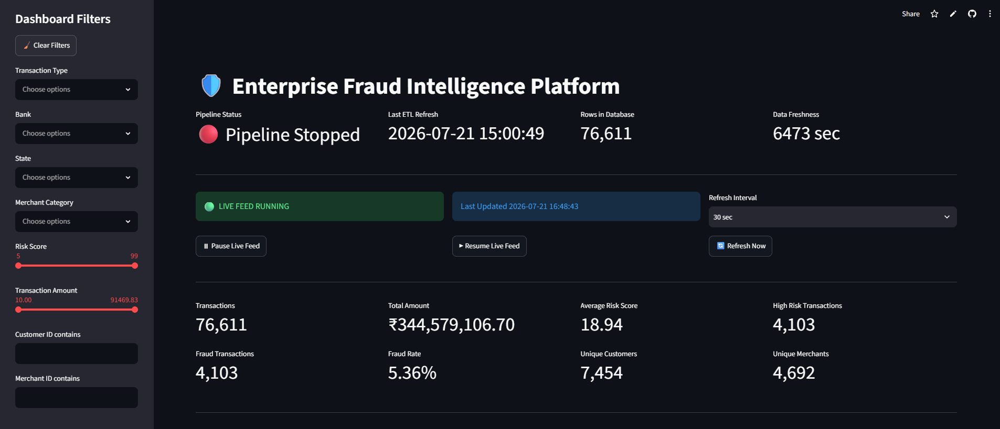
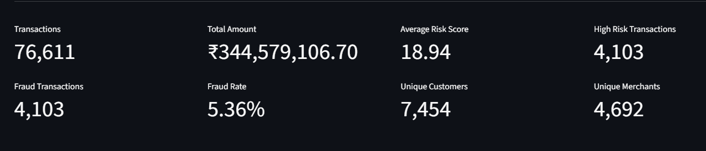
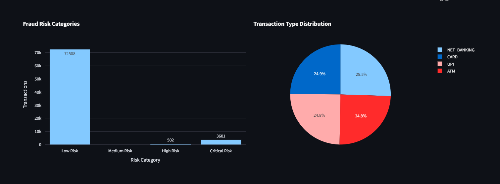
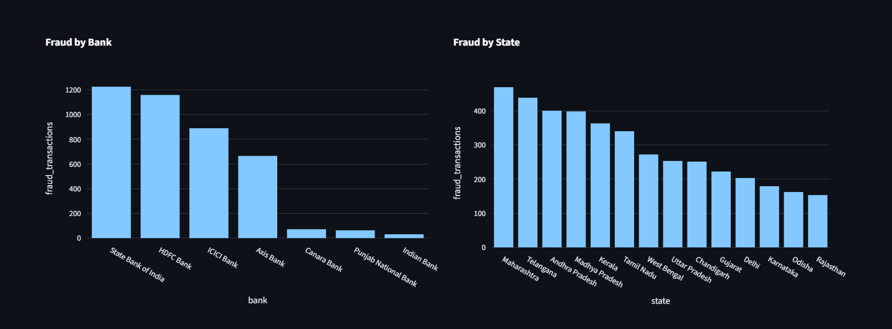
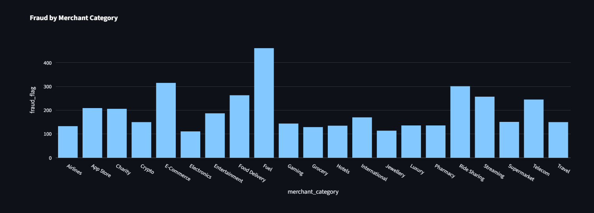
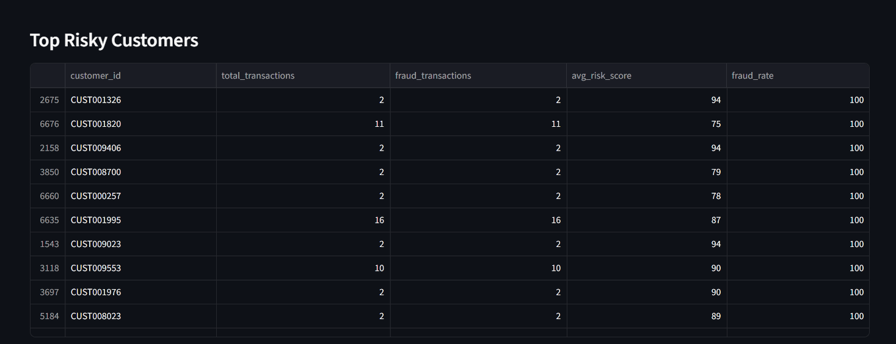
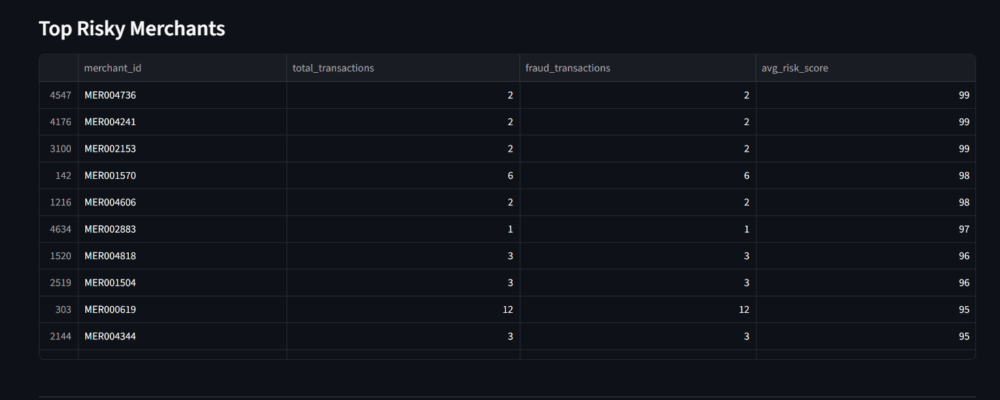

#  Enterprise Fraud Intelligence Platform


##  Live Dashboard

**Streamlit Dashboard**

https://fraud-intelligence-platform-dashboard-deploy.streamlit.app/

---

##  Project Overview

The **Enterprise Fraud Intelligence Platform** is a real-time fraud detection and analytics system that simulates financial transactions, streams them through Apache Kafka, processes them using Apache Spark Structured Streaming, stores transformed data in a Medallion Architecture (Bronze → Silver → Gold), loads analytical datasets into a cloud-hosted Neon PostgreSQL database, and visualizes fraud insights using an interactive Streamlit dashboard.

The project demonstrates an end-to-end modern Data Engineering pipeline suitable for Banking, FinTech, Payment Systems, and Fraud Analytics applications.

---

#  Key Features

- Real-time financial transaction simulator
- Fraud scenario simulation
- Apache Kafka streaming
- Spark Structured Streaming
- Bronze, Silver & Gold ETL architecture
- Cloud-hosted Neon PostgreSQL Data Warehouse
- Interactive Streamlit Dashboard
- Fraud KPIs & Executive Dashboard
- Customer Risk Analytics
- Merchant Risk Analytics
- Bank-wise Fraud Analysis
- State-wise Fraud Analysis
- Fraud Category Distribution
- Pipeline Health Monitoring
- Automated Warehouse Refresh Scheduler

---

#  System Architecture

```
Transaction Simulator
        │
        ▼
Apache Kafka
        │
        ▼
Spark Structured Streaming
        │
        ▼
Bronze Layer
        │
        ▼
Silver Layer
        │
        ▼
Gold Layer
        │
        ▼
Neon PostgreSQL
        │
        ▼
Streamlit Dashboard
```

---

#  Project Structure

```
Fraud-Intelligence-Platform/

│
├── config/
├── dashboard/
│     └── streamlit/
├── database/
│     ├── schemas/
│     ├── tables/
│     ├── views/
│     ├── indexes/
│     └── queries/
│
├── docs/
│     └── screenshots/
│
├── simulator/
│
├── spark/
│
├── streaming/
│
├── warehouse/
│     ├── bronze/
│     ├── silver/
│     └── gold/
│
├── gold_loader.py
├── silver_fact_loader.py
├── multi_gold_to_postgres_loader.py
├── warehouse_refresh_scheduler.py
│
├── requirements.txt
├── README.md
└── LICENSE
```

---

#  Tech Stack

### Programming

- Python

### Data Streaming

- Apache Kafka

### Data Processing

- Apache Spark Structured Streaming

### Storage

- Bronze Layer
- Silver Layer
- Gold Layer

### Database

- PostgreSQL (Local Development)
- Neon PostgreSQL (Cloud Deployment)

### Dashboard

- Streamlit
- Plotly

### Libraries

- Pandas
- SQLAlchemy
- Psycopg2
- PySpark

---

#  Dashboard Features

### Executive KPIs

- Total Transactions
- Fraud Transactions
- Fraud Rate
- Average Fraud Score

### Analytics

- Fraud by Bank
- Fraud by State
- Fraud by Merchant Category
- Customer Risk Ranking
- Merchant Risk Ranking
- Risk Distribution
- Transaction Trends

### Pipeline Monitoring

- Pipeline Status
- Last ETL Refresh
- Total Database Rows
- Data Freshness Indicator

---

#  Dashboard Preview

## Dashboard Overview

<p align="center">
  
</p>

---

## Executive KPIs

<p align="center">
  
</p>

---

## Risk Distribution

<p align="center">
  
</p>

---

## Bank & State Analysis

<p align="center">
  
</p>


---

## Merchant Category Analysis

<p align="center">
  
</p>

---

## Top Risky Customers

<p align="center">
  
</p>

---

## Top Risky Merchants

<p align="center">
  
</p>

---

#  Running the Project

## Clone Repository

```bash
git clone YOUR_GITHUB_REPOSITORY_URL
```

```
cd Fraud-Intelligence-Platform
```

---

## Install Dependencies

```
pip install -r requirements.txt
```

---

## Start Kafka

Run Apache Kafka and ZooKeeper.

---

## Generate Transactions

```
python simulator/engine/stream_generator.py
```

---

## Start Spark Bronze

```
python spark/bronze_stream.py
```

---

## Start Silver Transformation

```
python spark/silver_transform.py
```

---

## Generate Gold Layer

```
python spark/gold_aggregations.py
```

---

## Load Gold Data into Neon

```
python multi_gold_to_postgres_loader.py
```

---

## Start Warehouse Scheduler

```
python warehouse_refresh_scheduler.py
```

---

## Launch Dashboard

```
streamlit run dashboard/streamlit/app.py
```

---

#  Deployment

### Dashboard

Streamlit Community Cloud

### Database

Neon PostgreSQL

### Local Development

PostgreSQL

---

#  Future Improvements

- Docker Deployment
- Kubernetes
- Apache Airflow
- ML-based Fraud Detection
- Grafana Monitoring
- Prometheus Metrics
- Cloud Deployment on AWS/GCP/Azure
- CI/CD Automation
- REST API

---

#  Author

**Pallela Anurag**

Data Analytics | SQL | Python | Apache Spark | Kafka | Power BI | Streamlit

LinkedIn:
https://linkedin.com/in/pallelaanurag

GitHub:
https://github.com/Anurag-2601

---

#  Support

If you found this project helpful, please consider giving it a ⭐ on GitHub.
